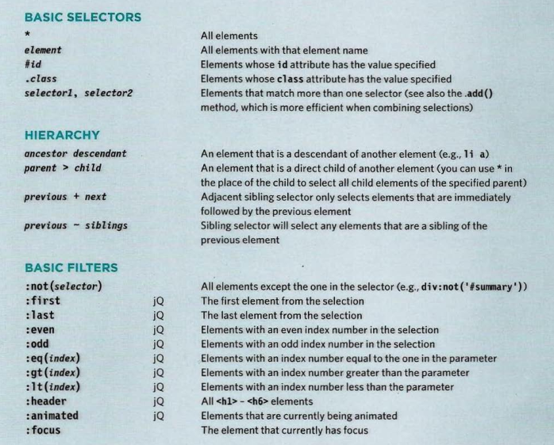
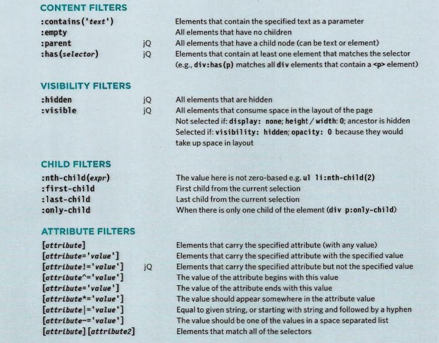
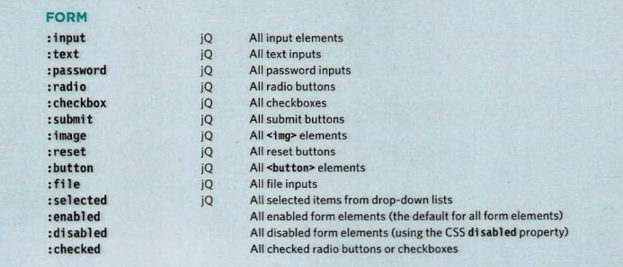
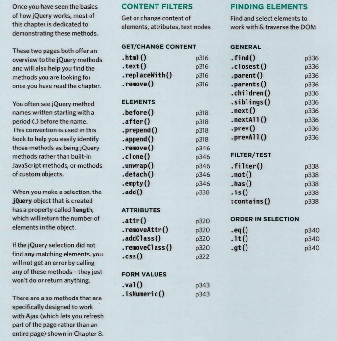
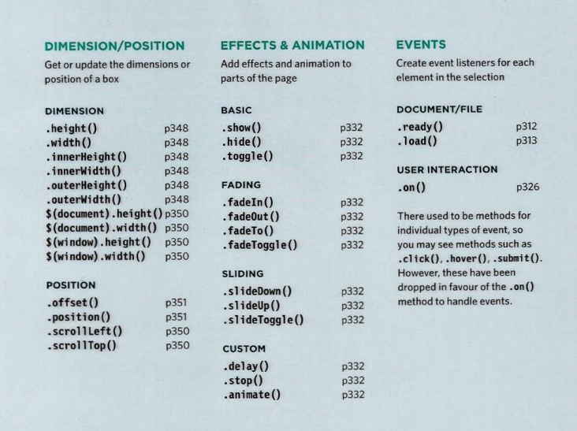

# JQuery

JQuery is a JavaScript file that you include in your website it lets you find elements using Css-style selectors and then do something with the elements using JQuery methods.

### Finding Elements

### DOING THINGS WITH YOUR SELECTION

