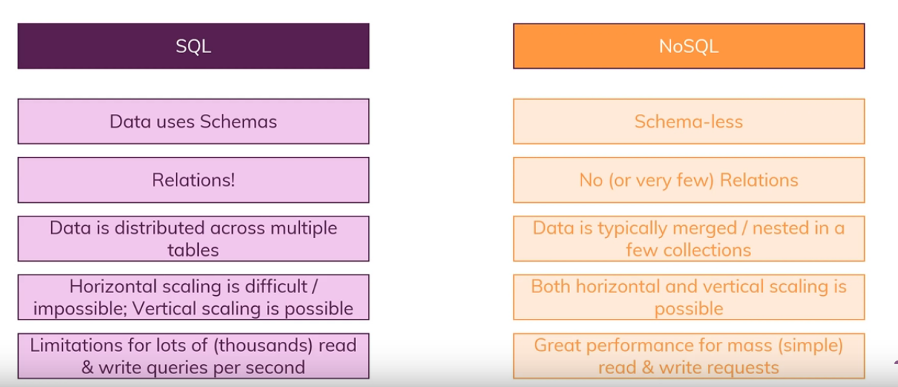

# no sql database

NoSQL can be defined as an approach to database designing, which holds a vast diversity of data such as key-value, multimedia, document, columnar, graph formats, external files, etc. NoSQL is purposefully developed for handling specific data models having flexible schemas to build modern applications.

### Document the following Vocabulary Terms

    `functional programming`: is the process of building software by composing pure functions, avoiding shared state, mutable data, and side-effects.
 
    `pure function` : Its return value is the same for the same arguments (no variation with local static variables, non-local variables, mutable reference arguments or input streams from I/O devices).
 
    `higher-order function:` function that takes a function as an argument, or returns a function.
 
`immutable state:` (unchangeable object) is an object     whose state cannot be modified after it is created.
    object: one of JavaScript’s data types. It is used to store various keyed collections and more complex entities.
 
    `object-oriented programming (OOP)`: is about creating objects that contain both data and functions.
 
    `class` :is an extensible program-code-template for creating objects, providing initial values for state (member variables) and implementations of behavior (member functions or methods).
 
    `prototype` : The prototype is an object that is associated with every functions and objects by default in JavaScript, where function’s prototype property is accessible and modifiable.
 
    `super` : keyword is used to access and call functions on an object’s parent.
 
    `inheritance` : the mechanism of basing an object or class upon another object (prototype-based inheritance) or class (class-based inheritance), retaining similar implementation.
 
    `constructor` : function that creates an instance of a class which is typically called an “object”.
 
    `instance` : is an object containing data and behavior described by the class.
 
    `context` : It refers to the object within the function being executed.
 
    `this`: this keyword refers to an object, that object which is executing the current bit of javascript code.
    Test Driven Development (TDD) : is a process for writing software that provably satisfies the software requirements.
 
    `Jest` : JavaScript testing framework maintained by Facebook, Inc. with a focus on simplicity.
 
    `Continuous Integration (CI)` :development practice that requires developers to integrate code into a shared repository several times a day.
 
    `unit test` : level of software testing where individual units components of a software are tested.
 
